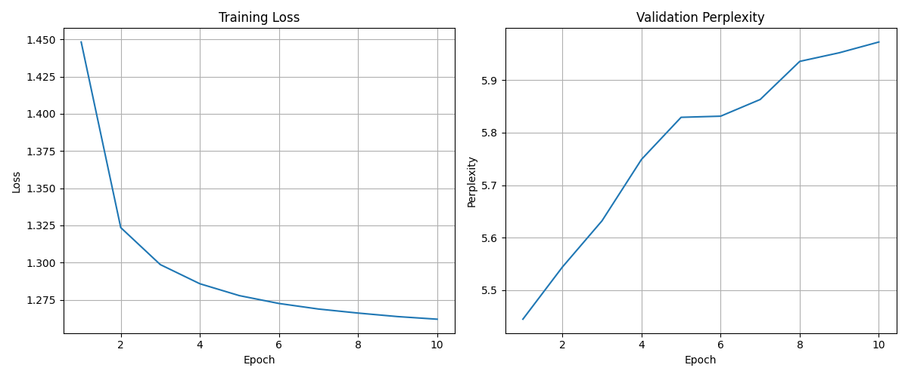

# Language Model From Scratch (LLM-V0)

## Project Overview
This project implements a neural language model from first principles, using PyTorch to build a character-level recurrent neural network that can generate text in the style of its training data. The model is trained on Shakespeare's works and demonstrates fundamental concepts in natural language processing and deep learning.



## Key Features
- **Character-level language modeling** with LSTM architecture
- **End-to-end implementation** from tokenization to text generation
- **GPU acceleration** with CUDA support
- **Configurable hyperparameters** via JSON configuration
- **Temperature-controlled text generation** for creative outputs
- **Comprehensive evaluation metrics** with perplexity measurement
- **Train/validation split** to monitor model performance
- **Visualization tools** for training metrics

## Technical Architecture
The project follows a modular design with clear separation of concerns:

### Core Components
- **Tokenizer**: Character-level vocabulary building and text encoding/decoding
- **Model**: LSTM-based neural network with embedding and projection layers
- **Dataset**: Efficient data handling with PyTorch's Dataset and DataLoader
- **Training**: Optimization loop with learning rate control and gradient updates
- **Evaluation**: Perplexity calculation and performance tracking
- **Generation**: Sampling strategies for text generation with temperature control

### Technology Stack
- Python 3.x
- PyTorch
- CUDA (optional, for GPU acceleration)
- Matplotlib for visualization
- NumPy and tqdm for utilities

## Installation and Setup

### Prerequisites
- Python 3.8 or higher
- CUDA-capable GPU (optional but recommended)

### Environment Setup
```bash
# Clone the repository
git clone https://github.com/yourusername/llm-v0.git
cd llm-v0

# Create and activate virtual environment
python -m venv venv
source venv/bin/activate  # On Windows: venv\Scripts\activate

# Install required packages
pip install -r requirements.txt
```

### Dataset Preparation
```bash
# Download Shakespeare dataset (if not already in data/raw)
mkdir -p data/raw
curl -o data/raw/shakespeare.txt https://raw.githubusercontent.com/karpathy/char-rnn/master/data/tinyshakespeare/input.txt
```

## Usage Guide

### Configuration
Edit `configs/default_config.json` to customize hyperparameters:
```json
{
    "data_file": "shakespeare.txt",
    "seq_length": 64,
    "batch_size": 32,
    "embedding_dim": 64,
    "hidden_dim": 128,
    "epochs": 10,
    "learning_rate": 0.001
}
```

### Training
```bash
# Train the model with default configuration
python scripts/train_model.py

# Monitor GPU usage during training (if using CUDA)
nvidia-smi -l 1
```

### Text Generation
```bash
# Generate text with default settings
python scripts/generate_text.py --seed "To be or not to be" --length 200

# Control creativity with temperature
python scripts/generate_text.py --seed "Once upon a time" --length 500 --temperature 0.5  # More focused
python scripts/generate_text.py --seed "Once upon a time" --length 500 --temperature 1.2  # More creative
```

### Visualization
```bash
# Plot training and validation metrics
python scripts/plot_metrics.py
```

## Results and Performance
The model demonstrates the ability to learn and generate Shakespeare-like text with the following characteristics:

- **Training Performance**:
  - Final training loss: ~1.28 after 10 epochs
  - Training time: ~2 minutes per epoch on NVIDIA GTX 1660 Ti

- **Generated Text Quality**:
  - Captures Shakespearean style elements
  - Replicates play structure with character names
  - Demonstrates understanding of basic language patterns

### Sample Output
```
To be or not to be the sun
Which should be too much and decast have power.
KING RICHARD III:
Ay, the dimn'd measure in him
As I begue and good one
ague not a senseless great head?
KING EDWARD IV:
Ay, be not Antive is
```

## Project Structure
```
llm-v0/
├── configs/                 # Configuration files
│   └── default_config.json
├── data/                    # Dataset storage
│   └── raw/                 # Raw text files
│       └── shakespeare.txt
├── saved_models/           # Saved model weights and metrics
├── scripts/                # Executable scripts
│   ├── generate_text.py    # Text generation script
│   ├── plot_metrics.py     # Visualization script
│   └── train_model.py      # Training script
├── src/                    # Source code
│   ├── dataset.py          # Dataset and dataloader implementation
│   ├── evaluate.py         # Evaluation metrics
│   ├── generate.py         # Text generation utilities
│   ├── model.py            # Neural network architecture
│   ├── tokenizer.py        # Tokenization utilities
│   ├── train.py            # Training loop implementation
│   └── visualization.py    # Plotting and visualization
├── .gitignore
├── README.md
├── requirements.txt
└── setup.py
```

## Future Improvements
This implementation provides a solid foundation, with several opportunities for enhancement:

### Architectural Improvements
- Implement Transformer architecture for better long-range dependencies
- Add attention mechanisms to improve context understanding
- Upgrade to subword tokenization (BPE, WordPiece) for better vocabulary efficiency

### Training Enhancements
- Implement learning rate scheduling and early stopping
- Add regularization techniques (dropout, weight decay)
- Experiment with different optimizers (AdamW, RMSprop)

### Generation Techniques
- Implement beam search for more coherent outputs
- Add top-k and nucleus (top-p) sampling for better generation quality
- Develop conditional text generation capabilities

### Engineering Improvements
- Add comprehensive unit tests
- Implement experiment tracking with Weights & Biases or TensorBoard
- Create a simple web interface for interactive text generation

## Contributing
Contributions to improve the model are welcome! Please feel free to submit a Pull Request.

## License
This project is licensed under the MIT License - see the LICENSE file for details.

## Acknowledgements
- The Shakespeare dataset is sourced from Andrej Karpathy's char-rnn repository

---

This project was developed as part of my journey to understand language models from first principles, building a foundation for working with more complex NLP systems.